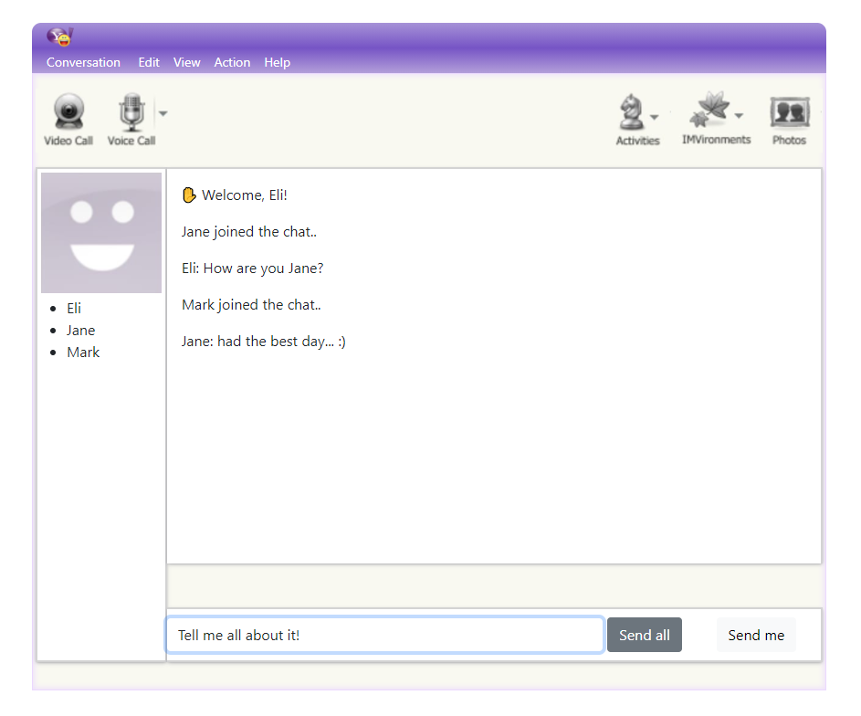

# Chatroom exercise

- Repository: `chatroom-exercise`
- Type of Challenge: `Learning`
- Duration: `2 - 4 days`
- Solo challenge

## What I learned 
- Set up a node environment
- Make a connection between different clients and the servers
- Work with sockets
- Configure express and socket.io for node
- Make a basic chatroom

## Features
- [x] Make a UI that makes it easy for people to send messages in this chatroom.
- [x] It must be possible to send a message to everyone or to yourself
- [x] Make sure we can identify who sent the message through a username.
- [x] Make a list to show everyone who is connected to the chatroom

## Preview

